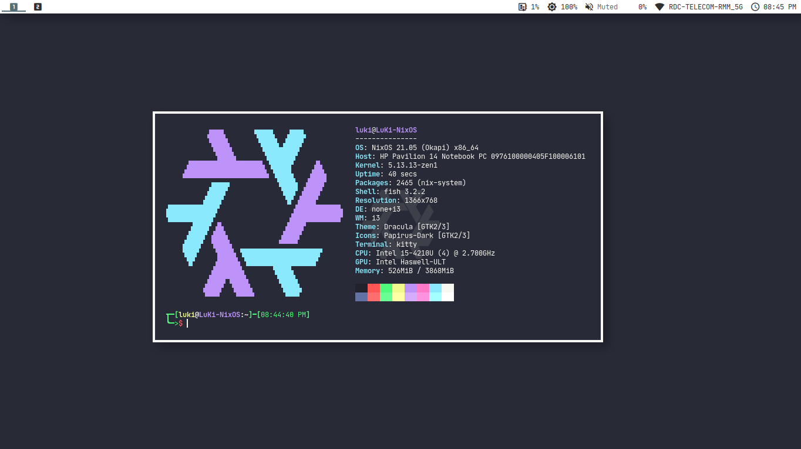

  
# NixOS Config
## Personal configuration of the NixOS.
## [Install](INSTALL.md)

---
|                |                               |
| -------------  | ----------------------------- |
| Shell          | fish                          |
| Terminal       | kitty                         |
| Filesystem     | Btrfs (with Zstd compression) |
| Bootloader     | GRUB with UEFI                |
| Window manager | i3                            |
| Compositor     | picom                         |
| Notifications  | Dunst                         |
| NixOS version  | 21.05                         |
  

