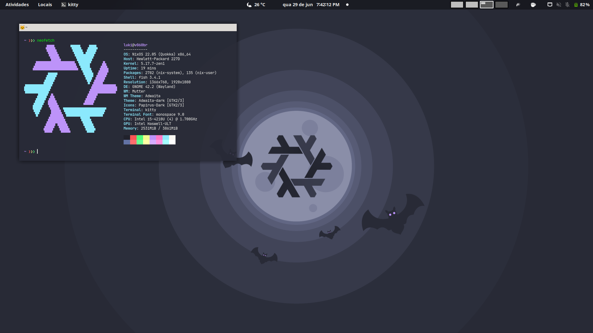

  
# NixOS configurations
## Personal configurations of NixOS.

## System:
| Category       | Name                          |
| -------------  | ----------------------------- |
| NixOS version  | 21.11 (Porcupine)             |
| Shell          | fish                          |
| Terminal       | kitty                         |
| Launcher       | Rofi                          |
| Filesystem     | Btrfs (with zstd compression) |
| Bootloader     | GRUB (with UEFI)              |
| Window manager | i3                            |
| Compositor     | picom                         |
| Notifications  | Dunst                         |

## Themes:
| Category       | Name                          |
| -------------  | ----------------------------- |
| GTK Theme      | Dracula                       |
| GTK Icon theme | Papirus                       |
| Terminal font  | JetBrains Mono Nerd Font      |
  
---
  
### [configuration.nix](Nix/configuration.nix)
### [packages.nix](Nix/packages.nix)
### [home.nix](nixpkgs/home.nix)
### [INSTALL.md](INSTALL.md)

