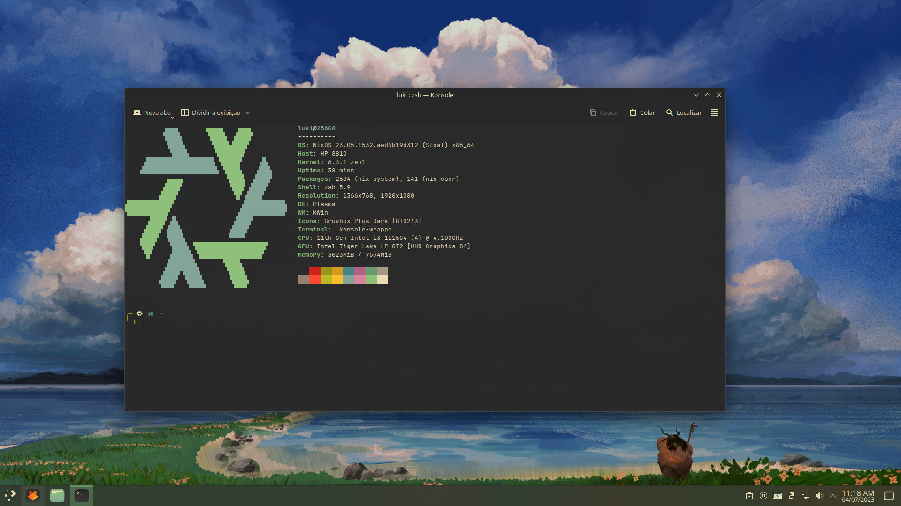

  
# NixOS configurations

## System:
| Category            | Name                          |
| ------------------- | ----------------------------- |
| NixOS version       | 23.05 (Stoat)                 |
| Shell               | zsh                           |
| Terminal            | Konsole                       |
| Filesystem          | Btrfs (with zstd compression) |
| Bootloader          | systemd-boot                  |
| Desktop environment | KDE Plasma                    |

## Themes:
| Category       | Name                          |
| -------------  | ----------------------------- |
| Theme          | Gruvbox                       |
| Icon theme     | Gruvbox Plus                  |
| Terminal font  | JetBrains Mono Nerd Font      |
  
---
  
### [configuration.nix](Nix/configuration.nix)
### [packages.nix](Nix/packages.nix)
### [home.nix](nixpkgs/home.nix)
### [INSTALL.md](INSTALL.md)

